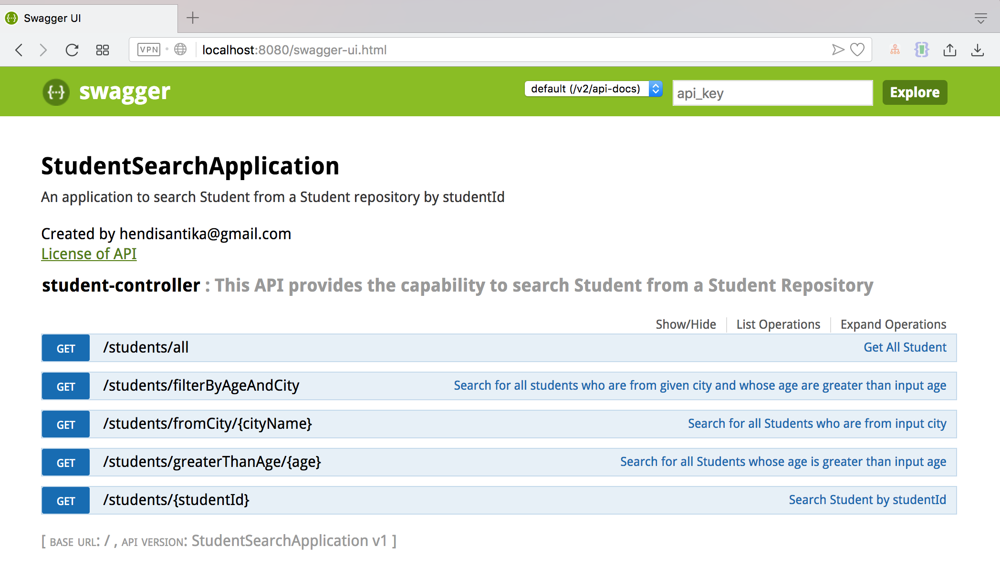

# Spring Boot Swagger

RESTful API Documentation Using Swagger and Spring Boot


What is Swagger

Swagger is a specification for documenting REST APIs. It describes the api format including URL, method, and representation to describe REST web services. Swagger is meant to enable the service producer to update the service documentation in real time so that client and documentation systems are moving at the same pace as the server. The methods, parameters, and models description are tightly integrated into the server code, thereby maintaining the synchronization in APIs and its documentation. The specification asks you to include information like:

    What are all the operations that your API supports?
    What are your API’s parameters and what does it return?
    Does your API need some authorization?
    And even fun things like terms, contact information and license to use the API.

Swagger is created by Wordnik, which defines the specification and framework for their internal development use for “develop.wordnik.com” and underlying system. They started developing the framework in early 2010—being released, is currently also used by Wordnik’s APIs, which powers both internal and external API clients. Here in this post we will create a Spring Boot project for a RESTful Api which is documented with Swagger. To integrate Swagger with Spring Boot we need to include the following maven dependencies in our pom.xml file.


```
<!-- swagger dependencies -->
 <dependency>
	<groupId>io.springfox</groupId>
	<artifactId>springfox-swagger2</artifactId>
</dependency>

<dependency>
	<groupId>io.springfox</groupId>
	<artifactId>springfox-swagger-ui</artifactId>
</dependency>
```

All the Swagger annotations for documenting the controller are self explanatory. Following are some of the annotation used here

@Api →  Narrates the description about what in general is the responsibility of the controller.

@ApiOperation →  Narrates the responsibility of the specific method.

@ApiParam → Narrates the parameter the method is expecting and also tells whether it is mandatory or not.

Run this project by this command : `mvn clean spring-boot:run`

Open your browser :

`http://localhost:8080/swagger-ui.html`

